### Escuela Colombiana de Ingeniería

### Ciclo de Vida de Desarrollo de Software

### Desarrollo Dirigido por Pruebas + DIP + DI

## Nicolas Bernal

Para este taller se va a trabajar sobre el juego del ahorcado.

El sistema actual de puntuación del juego comienza en 100 puntos y va
descontando 10 puntos cada vez que se propone una letra incorrecta.

Algunos usuarios han propuesto diferentes esquemas para realizar la
puntuación, los cuales se describen a continuación:

* OriginalScore:
    * Es el esquema actual, se inicia con 100 puntos.
    * No se bonifican las letras correctas.
    * Se penaliza con 10 puntos con cada letra incorrecta.
    * El puntaje minimo es 0.

* BonusScore:
    * El juego inicia en 0 puntos.
    * Se bonifica con 10 puntos cada letra correcta.
    * Se penaliza con 5 puntos cada letra incorrecta.
    * El puntaje mínimo es 0

* PowerBonusScore:
    * El juego inicia en 0 puntos.
    * La $i-ésima$ letra correcta se bonifica con $5^i$.
    * Se penaliza con 8 puntos cada letra incorrecta.
    * El puntaje mínimo es 0
    * Si con las reglas anteriores sobrepasa 500 puntos, el puntaje es
        500.

Lo anterior, se traduce en el siguiente modelo, donde se aplica el
principio de inversión de dependencias:


### Parte I

1. Haga un fork del proyecto (no lo descargue directamente!).
   
   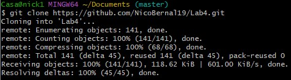
   
4. A partir del código existente, implemente sólo los cascarones del
   modelo antes indicado.

6. Haga la especificación de los métodos calculateScore (de las tres
   variantes de GameScore), a partir de las especificaciones
   generales dadas anteriormente. Recuerde tener en cuenta: @pre,
   @pos, @param, @throws.

   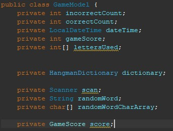
   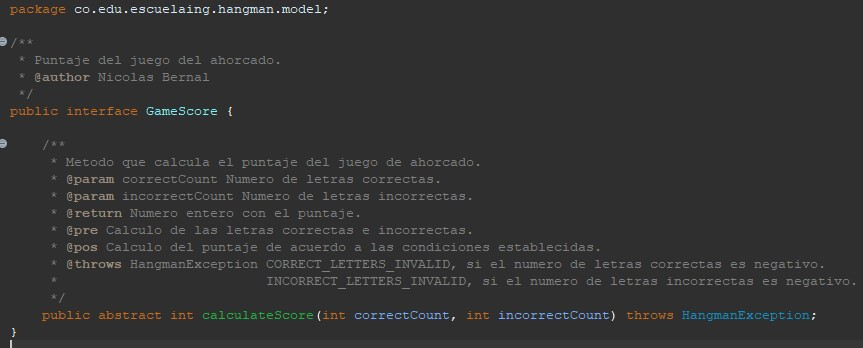
   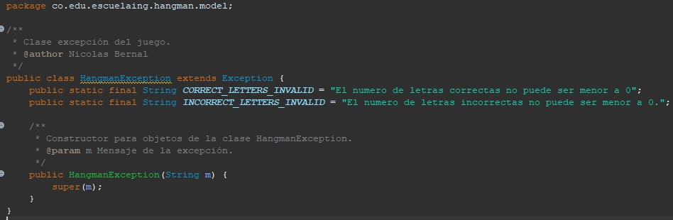
   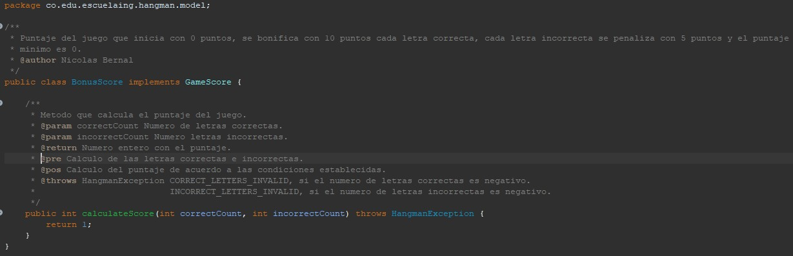
   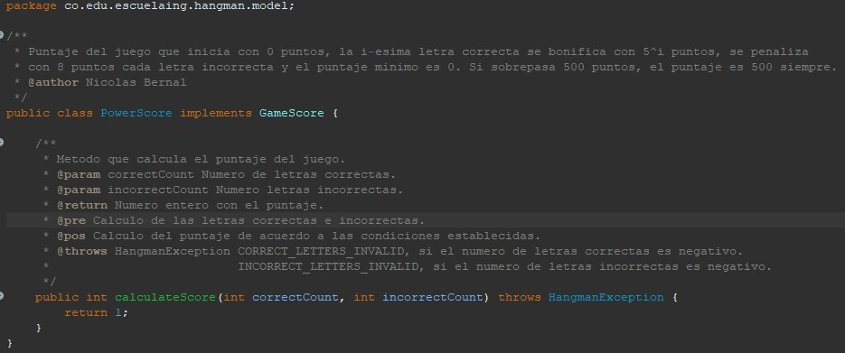
   
8. Haga commit de lo realizado hasta ahora. Desde la terminal:

    ```sh		
    git add .			
    git commit -m "especificación métodos"
    ```

    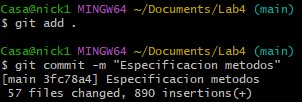

10. Actualice el archivo `pom.xml` e incluya las dependencias para la ultima versión de JUnit.

    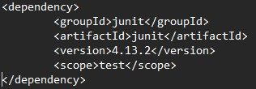

12. Teniendo en cuenta dichas especificaciones, en la clase donde se
   implementarán las pruebas (GameScoreTest), en los
   comentarios iniciales, especifique las clases de equivalencia para
   las tres variantes de GameScore, e identifique
   condiciones de frontera.

14. Para cada clase de equivalencia y condición de frontera, implemente
   una prueba utilizando JUnit.

   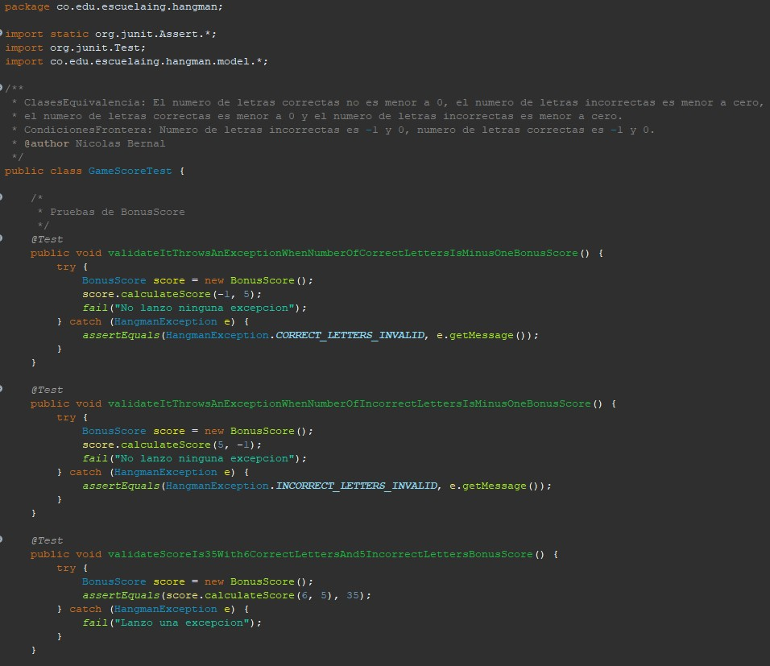

16. Haga commit de lo realizado hasta ahora. Desde la terminal:

    ```sh		
    git add .			
    git commit -m "implementación pruebas"
    ```

    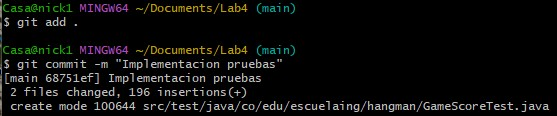

17. Realice la implementación de los 'cascarones' realizados anteriormente.
   Asegúrese que todas las pruebas unitarias creadas en los puntos anteriores
   se ejecutan satisfactoriamente.

   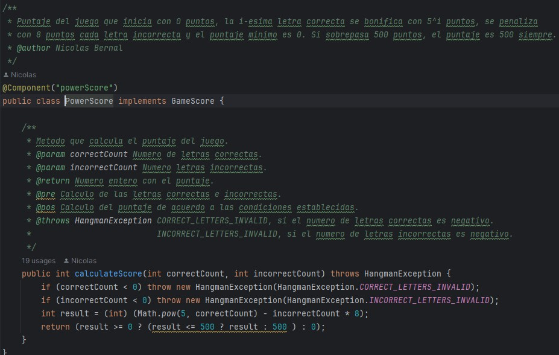
   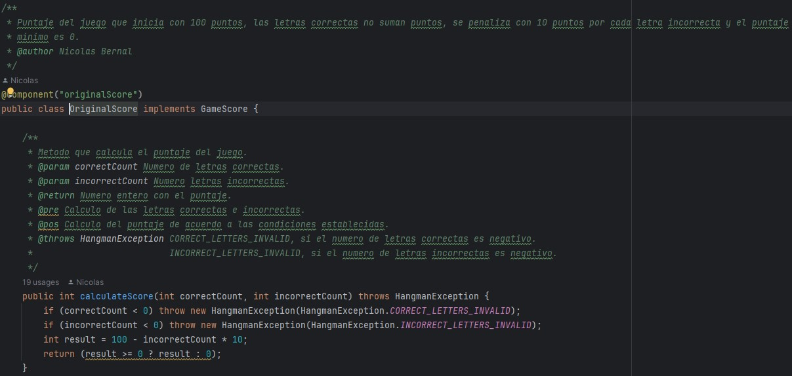
   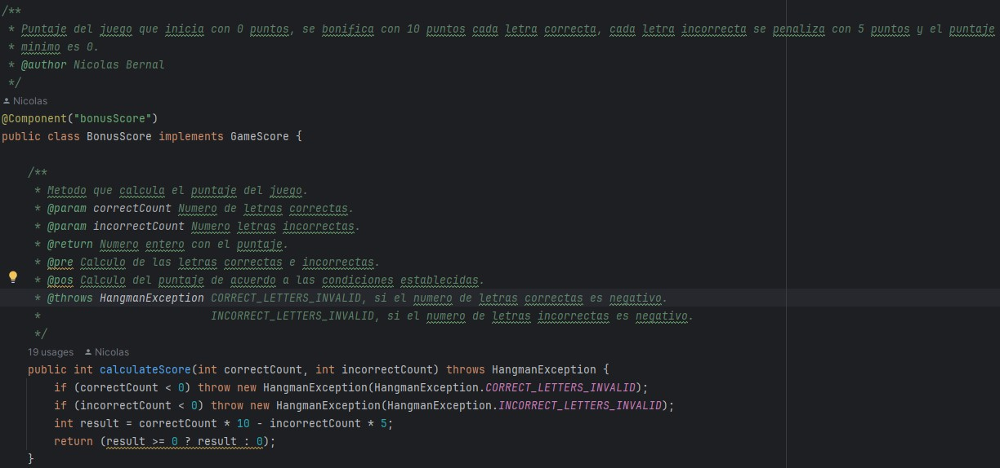

19. Al finalizar haga un nuevo commit:

    ```sh		
    git add .			
    git commit -m "implementación del modelo"
    ```

    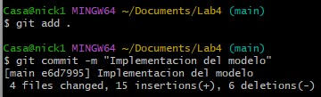

20. Para sincronizar el avance en el respositorio y NO PERDER el trabajo, use
    el comando de GIT para enviar los cambios:

    ```sh
    git push origin main
    ```

    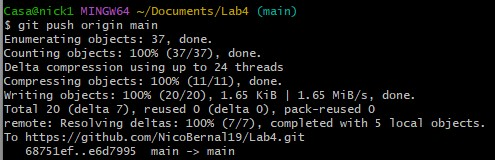

### Parte II

Actualmente se utiliza el patrón FactoryMethod
que desacopla la creación de los objetos para diseñar un juego
de ahorcado (revisar setup.factoryMethod, el
constructor de la clase GUI y HangmanFactoryMethod).

1. Utilizando el HangmanFactoryMethod (MétodoFabrica) incluya el
   OriginalScore a la configuración.

* Mediante la configuración de la Inyección de
  Dependencias se pueda cambiar el comportamiento del mismo, por
  ejemplo:
    * Utilizar el esquema OriginalScore.
    * Utilizar el esquema BonusScore.
    * Utilizar el idioma francés.
    * Utilizar el diccionario francés.
    * etc...
      
   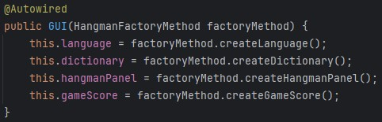
  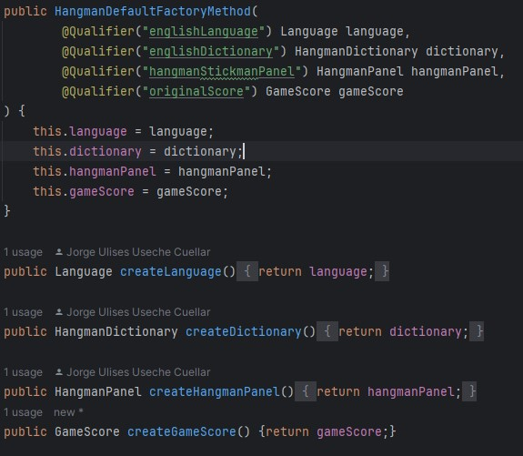
